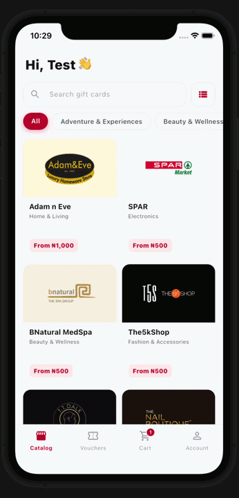
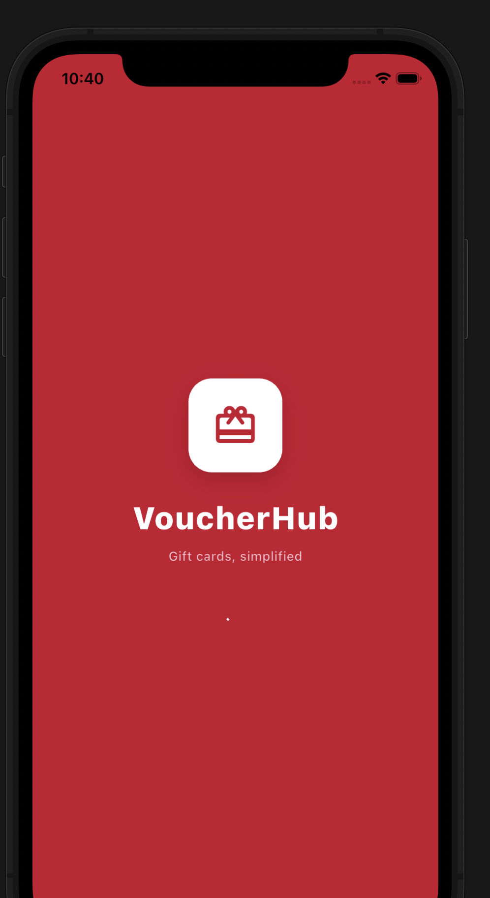
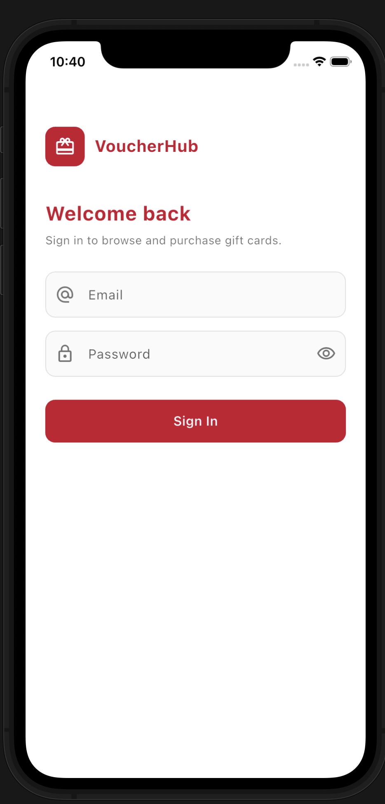
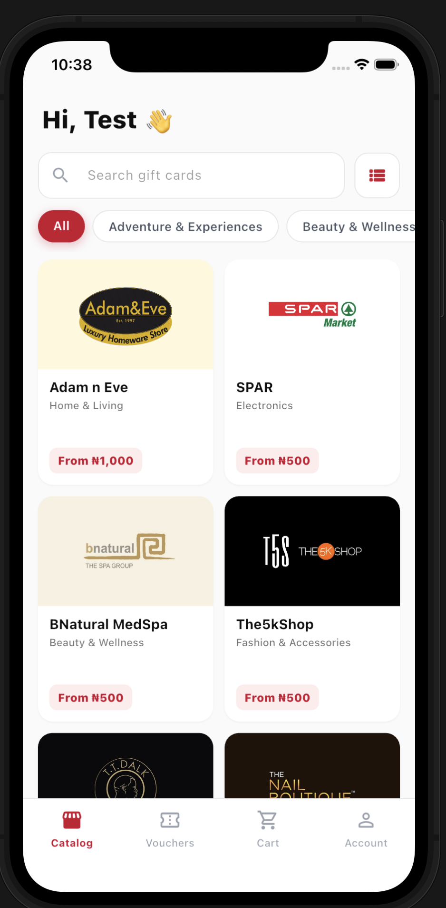
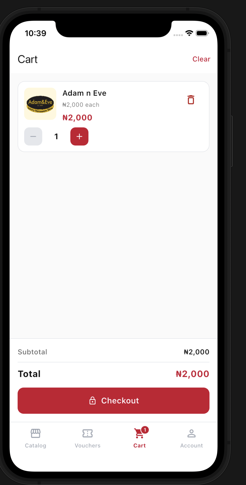
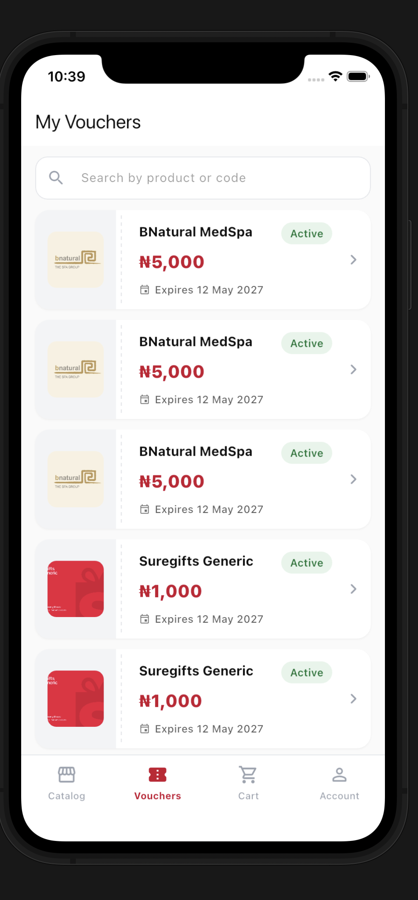
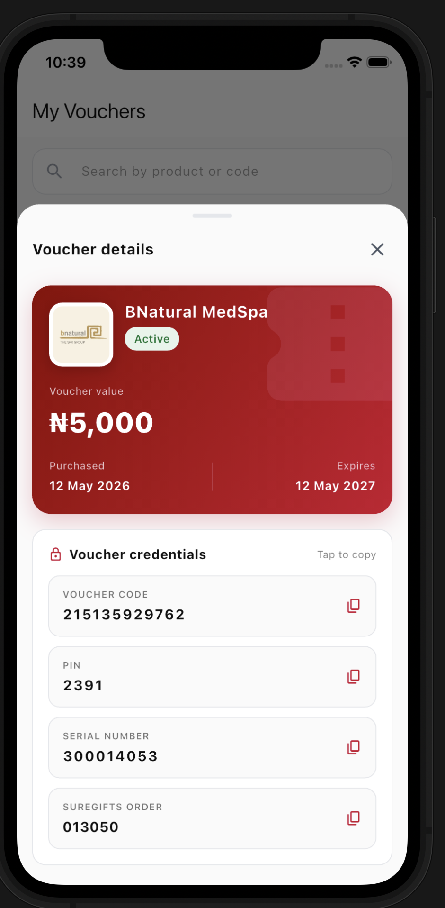
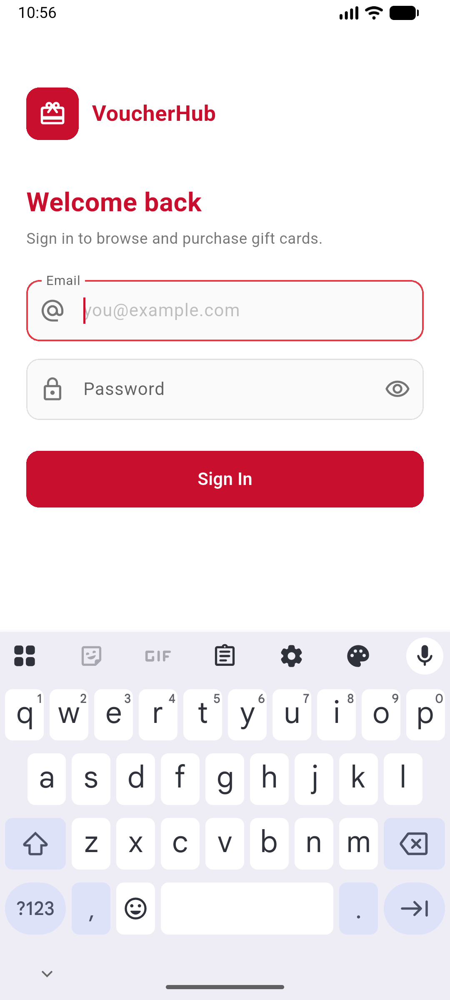
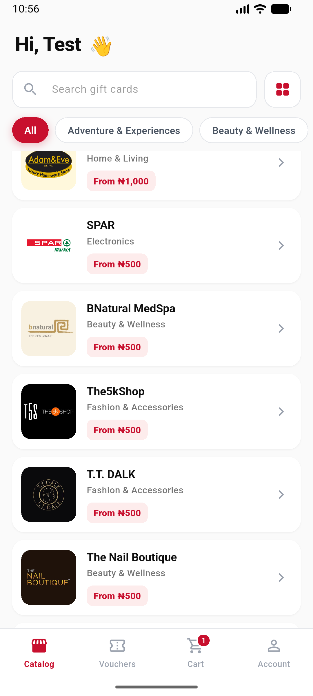
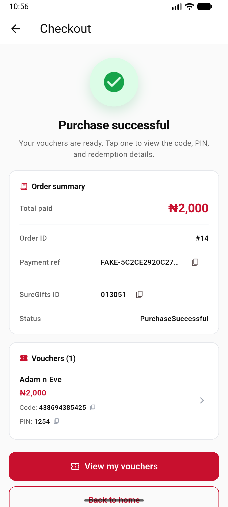

# VoucherHub

A Flutter app for browsing, purchasing, and redeeming SureGifts gift cards. Submitted for the SureGifts mobile assessment.

Stack: Flutter (Dart `>=3.6.0 <4.0.0`), Provider + GetIt, Dio, `flutter_secure_storage`, `shared_preferences`, `encrypt`, `flutter_dotenv`.

---

## Features

- **Auth** — email + password login backed by JWT access/refresh tokens. Refresh is single-flight; refresh failure clears storage and routes to login.
- **Catalogue** — paginated gift-card listing with search, category chips, a grid/list view toggle, and cached results that stay visible during offline refresh attempts.
- **Product detail** — fixed denominations or open amount with min/max validation, quantity stepper, floating "add to cart" bar that hides when the amount keyboard is open.
- **Cart** — add/edit quantity, remove, clear, server-side totals (subtotal, fees, tax) with retry on failure.
- **Checkout** — purchase flow with status-aware result screen (success, payment-successful-but-processing, pending, purchase failed, unknown).
- **My Vouchers** — pinned search bar, voucher list, pull-to-refresh, modal voucher details (code, PIN, serial, redemption URL, terms).
- **Polished UX** — shimmer skeletons, typed empty/error states, cached-first loading for catalog/voucher data, copy-to-clipboard with toast, snackbars on failure, currency formatting.

---

## Screenshots



| Splash | Login | Catalog |
| :----: | :---: | :-----: |
|  |  |  |

| Cart | My Vouchers | Voucher details (modal) |
| :--: | :---------: | :---------------------: |
|  |  |  |

| Login (Android) | Login (focused, keyboard up) | Catalog (list view) | Checkout success |
| :-------------: | :--------------------------: | :-----------------: | :--------------: |
|  |  |  |  |

---

## Setup

### Prerequisites

- Flutter SDK `>=3.6.0 <4.0.0` (run `flutter --version` to check)
- Xcode (iOS) and/or Android Studio + SDK (Android)
- CocoaPods (`sudo gem install cocoapods`) for iOS

### 1. Create your `.env` file

Copy the example below to a file named `.env` at the **project root** (next to `pubspec.yaml`). This file is listed in `.gitignore` and must **never** be committed.

```env
# Base URL
BASE_URL=https://assessment.suregifts.com.ng/

# AES-256-CBC encryption credentials
# ENCRYPTION_KEY must be exactly 32 characters
# ENCRYPTION_IV  must be exactly 16 characters
ENCRYPTION_KEY=your_32_char_encryption_key_here
ENCRYPTION_IV=your_16_char_iv!!
```

> **Important:** Replace the placeholder values with the real key and IV shared by your backend team. Mismatched lengths will cause a runtime exception.

### 2. Install dependencies

```bash
flutter pub get
```

### 3. Run

```bash
flutter run
```

`main()` loads `.env` via `flutter_dotenv` before `EnvConfig` is initialised, so `BASE_URL`, `ENCRYPTION_KEY`, and `ENCRYPTION_IV` are available throughout the app from the very first frame.

### Test credentials

```text
test@mail.com / Password1@
```

(shown at the bottom of the login screen for convenience)

### Tooling

```bash
# Static analysis — analysis_options.yaml uses the default Dart lint set
flutter analyze

# Tests
flutter test
```

---

## Architecture

Clean architecture, organised feature-first. Cross-cutting infrastructure lives in `lib/core/`; each user-facing capability is a self-contained tree under `lib/features/<feature>/`.

### Directory layout

```text
lib/
├─ core/
│  ├─ data/
│  │  ├─ network/          # Dio NetworkService + auth/refresh interceptor
│  │  ├─ memory/           # InMemory: process-lifetime session flags
│  │  └─ database/         # NetworkFailure / CacheFailure types
│  ├─ di/                  # Global GetIt instance + initInjectors()
│  ├─ managers/            # LocalStorageService (SharedPreferences wrapper)
│  ├─ platform/            # EnvConfig, SecuredStorage, base-URL constants
│  ├─ presentation/
│  │  ├─ domain/           # UseCase typedefs, UI error types
│  │  ├─ state/            # ProviderState mixin, ProviderInitializer
│  │  └─ widgets/          # AppCard, AppPrimaryButton, AppShimmer, ...
│  └─ utils/               # router, currency_format, error_helpers, money_formatter
└─ features/
   └─ <feature>/
      ├─ data/
      │  ├─ datasources/   # <x>_remote_datasource.dart + endpoint.dart
      │  ├─ models/        # DTOs
      │  └─ repositories/  # <x>_repository_impl.dart
      ├─ domain/
      │  ├─ di/            # <feature>_injector.dart — registers everything in this feature
      │  ├─ repositories/  # Abstract repository interface
      │  └─ usecases/      # One class per use case + an aggregator file
      └─ presentation/
         ├─ pages/         # Screens (always ≤ 250 lines — subwidgets live in widgets/)
         ├─ state/         # ChangeNotifier providers
         └─ widgets/       # Feature-specific subwidgets
```

Features: `account`, `auth`, `cart`, `checkout`, `home`, `products`, `splash`, `vouchers`.

### Dependency injection

A single global GetIt instance (`inject`) in `lib/core/di/di_config.dart`. `initInjectors()` is called once from `lib/main.dart` before `runApp()` and fans out to per-feature `*Injector()` functions.

Convention inside an injector: `RemoteDataSource → Repository → <one lazySingleton per UseCase> → Provider`.

Every provider that the UI consumes is exposed in `lib/core/presentation/state/provider_initializer.dart` via `ChangeNotifierProvider.value`, and `MultiProvider` is wired in at app root.

### Network layer

`NetworkServiceImpl` wraps one shared Dio instance. `baseUrl` comes from `EnvConfig.baseUrl`, which reads `BASE_URL` from `.env` (with `STAGING_BASE_URL` as fallback).

`NetworkInterceptor` handles authentication transparently:

- Reads the **encrypted** token from `SecuredStorage`, **decrypts** it with `EncryptionUtils.decrypt()`, then attaches `Authorization: Bearer <plaintext_token>` — so the raw ciphertext never leaves the device.
- Skips the header for `skipToken()` paths (login endpoint).
- On `401`: wipes both stores and navigates to `LoginScreen` via the global `router`. `_loggingOut` flag prevents re-entry.

### Error + result flow

Errors cross the layers as specific types, not generic exceptions:

1. **Datasource** calls `handleNetworkResponse()` on the raw `NetworkServiceResponse`, which throws `ApiResponseException` / `NetworkConnectivityException` on failure.
2. **Repository** wraps every datasource call in `guardedApiCall<T>()`, which converts those to `NetworkFailure`.
3. **Usecase** returns `Either<UIError, T>` (dartz). It catches `NetworkFailure`/`CacheFailure` and maps them to a `UIError` via `getUIErrorFromUsecaseFailure`, attaching a usecase-specific fallback message.
4. **Provider** `fold`s the `Either` and exposes per-operation `loading` / `error` / `data` state for the UI.

Net result: the UI never sees a raw exception, and error messages are derived once at the seam, not duplicated per screen.

### State management

`Provider` + `ChangeNotifier`. Two patterns coexist:

- **Single-operation providers** use the `ProviderState` mixin in `lib/core/presentation/state/provider_state.dart` — gives `isLoading` / `hasError` / `errorMessage` / `payload` and a connectivity hook.
- **Multi-operation providers** (e.g. `VouchersProvider`, `CartProvider`, `ProductsProvider`) keep **per-operation** loading/error fields — `listLoading` vs `detailLoading`, `addingItem` vs `loading`, etc. Necessary when one screen drives several independent calls in parallel; a single shared `isLoading` would hide which one is in flight.

`ViewModelProvider` / `DualViewModelProvider` (`provider_view_model.dart`) are available when you want to scope a provider's lifetime to one screen with an `onModelReady` init hook, instead of using the app-wide singletons.

### Storage

Two distinct stores, chosen deliberately:

- **`SecuredStorage`** (backed by `flutter_secure_storage`) — holds **tokens and only tokens**. Keys are typed in `SecureStorageStrings`. Tokens never go into SharedPreferences.
- **`LocalStorageService`** (backed by `shared_preferences`) — holds the cached user profile and other non-secret state, including offline-friendly catalog/voucher snapshots. Keys are typed in `SPref`. Serialised user data round-trips through `UserModel.toJson` / `fromJson`, so the stored shape must stay in sync with the model.

`InMemory` (`lib/core/data/memory/cache_helpers.dart`) is a process-lifetime singleton for transient session flags (`hasSession`, `requiresPin`, `username`, …). Registered as a `lazySingleton`. Cleared on sign-out alongside both stores.

### Routing

`lib/core/utils/router.dart` exposes a top-level `router` (`RouterService`) that holds the app's `navigatorKey`. `MaterialApp.navigatorKey` points at it, which is how the network interceptor force-navigates on logout without a `BuildContext`.

Inside widgets, `Navigator.of(context)` is still used directly — `router.push` / `router.pushAndRemoveUntil` are for navigation from non-widget code.

### Screen size discipline

Every screen file under `lib/features/<feature>/presentation/pages/` is kept **≤ 250 lines**. Anything bigger is split into subwidgets:

- Generic widgets (used across features) → `lib/core/presentation/widgets/`
- Feature-specific subwidgets → `lib/features/<feature>/presentation/widgets/`

---

## Assumptions made

Where the brief or API was silent, I made the following calls:

### Product & domain

- **NGN / Nigeria-only**. All formatting and copy assume Naira; multi-currency display is out of scope.
- **Voucher status is derived, not authoritative**. The `GET /api/vouchers` payload has no status field, so `VoucherStatus` is computed from `expiryDate` vs. `DateTime.now()` (`active` / `expired` / `unknown`).
- **Categories come from the product list**, not a dedicated endpoint. The catalogue derives the unique category set client-side from already-loaded products.
- **Open-amount validation** uses the product's `minValue` / `effectiveMaxValue`. If the API returns no max, only the minimum is enforced.
- **Quantity is capped at 99** in the product detail stepper — arbitrary but high enough that the cap is unlikely to bite during the assessment.

### Auth & security

- **Tokens are encrypted at rest.** On login the `accessToken` is AES-256-CBC encrypted by `EncryptionUtils.encrypt()` before being written to `flutter_secure_storage`. The network interceptor decrypts it with `EncryptionUtils.decrypt()` just before attaching it to each request — the plaintext token is never persisted.
- **Encryption credentials live in `.env`** (`ENCRYPTION_KEY` = 32 chars, `ENCRYPTION_IV` = 16 chars). The file is git-ignored and must be supplied separately per environment.
- **Passwords** are encrypted via `EncryptionUtils.encryptPassword()` before transmission where required by the API.
- **Cached user profile** lives in `shared_preferences`. Profile data is not considered a secret.
- **Single global `navigatorKey`** is acceptable for this scope; force-logout uses it to redirect to `LoginScreen` without a `BuildContext`.
- **Test credentials are shown on the login screen** for review convenience. Would be removed for any real release.

### State & data flow

- **Client-side search** on the vouchers screen — filters the already-loaded list (product name / product code / voucher code). No `?q=` parameter is sent to the API.
- **Catalogue pagination** triggers when the scroll position is within 400px of the bottom; not configurable per-platform.
- **Offline pull-to-refresh on the catalogue keeps the last successful list on screen**. A failed refresh reports the error without blanking previously cached products.
- **Cart totals** are fetched server-side after every mutation and shown with their own loading/error state, separate from the cart-items state.
- **Checkout result** screen polls only the response of the initial purchase call; there is no follow-up polling for `purchaseProcessing` / `paymentSuccessful` states. The user is invited back to the vouchers screen instead.

### UX

- **Voucher details** open in a `DraggableScrollableSheet` (85% initial, drag down to dismiss) — chosen over a full-screen route to keep the user anchored in the list.
- **Search bar on the vouchers screen is pinned**; only the list underneath scrolls.
- **No dark mode**. Light theme only.
- **No haptics** on key actions (add to cart, copy code). Toast + snackbar are the only feedback channels.


### App identity

- **App display name** is `VoucherHub` on Android (`android:label`), iOS (`CFBundleDisplayName`), and the `MaterialApp` title.
- **Dart package name** remains `suregift_test` — renaming the Pub package would touch every `package:suregift_test/...` import without changing anything the user sees.
